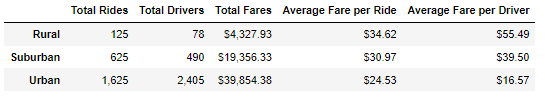

# PyBer_Analysis
## Purpose
V. Isualize is asking Omar and I to generate a DataFrame showing the ride-sharing data by city type. Then they want us to calculate the weekly fares for each city type. From these calculations, V. Isualize requests a line graph that shows the weekly fares by each city type from January 2019 through April 2019. Lasltly, they want a written report of our results and how PyBer should address the differences between city types.
## Results
\
The image above is the summary DataFrame of the ride-sharing data by city type. Here, we can see that people who live in urban cities use ride-sharing more than in the suburban cities and even more than in the rural cities. We can also see the same trend for 'Total Drivers' and 'Total Fares.' However, the average fare per ride and average fare per driver is highest in rural cities and the lowest in urban cities.\
\
The image above shows the weekly total fare by city type over time, specifically, January 2019 through April 2019. Here, we can see the difference in total fares per city type. Urban cities are the have the highest total fares, while, rural cities have the lowest total fares. However, they do have somewhat a similar trend. All three city types have a spike towards the end of February. Urban cities have a few more spikes after March until April, whereas, suburban cities and rural cities stay steady. Lastly, urban and rural cities have a spike in April. However, suburban cities look like they are about to hit a spike after April ends as it is on an upward trend.
## Summary
From the results above, I would recommend three ideas regarding the differences between the city types. One recommendation is to decrease the total number of drivers for urban cities. There are more drivers than there were total rides. This caused the average fare per driver for urban cities to be so low. Another recommendation is to increase the fares for rural cities. The demand for ride-sharing is lower in rural cities. The last recommendation is to decrease the fares for urban cities. This will cause the total fares to decrease.
